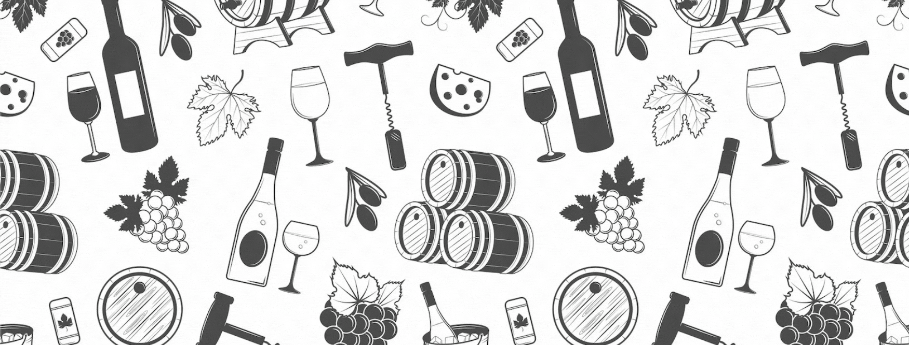

## About

This i a simple REST APIs that return some JSON data that describes a breakdown of the TOTAL percentage of year, variety, region and year + variety information for a specific wine, ordered from highest percentage to lowest.

---

## Endpoint

### _/api/search?{search}_

> It returns the wine details for a specific search with all the relevant details of the wine. It takes the lot code of the wine as a parameter

### _/api/search/{lotCode||description}_

> It supports the searching for wines by the lot code or description of different lists.

### _/api/breakdown/year/{lotCode}_

> It returns a breakdown of the TOTAL percentage for each unique year value.

### _/api/breakdown/variety/{lotCode}_

> It returns a breakdown of the TOTAL percentage for each unique variety value.

### _/api/breakdown/region/{lotCode}_

> It returns a breakdown of the TOTAL percentage for each unique region value.

### _/api/breakdown/year-variety/{lotCode}_

> It returns a breakdown of the TOTAL percentage for each unique combination of year and variety.

---

## Instructions

This is an Node.js/Express.

To get starter:

```
// clone repo

$ git clone https://github.com/PhillipeAlves/wine_api.git

// move into the directory

$ cd wine_api

// install dependencies

$ npm install

// start the server

$ npm run dev (development) || npm run start (production)

```
